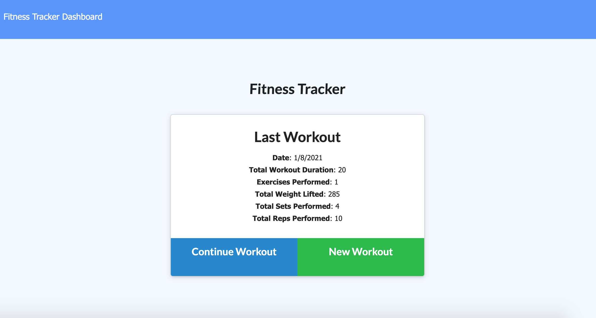
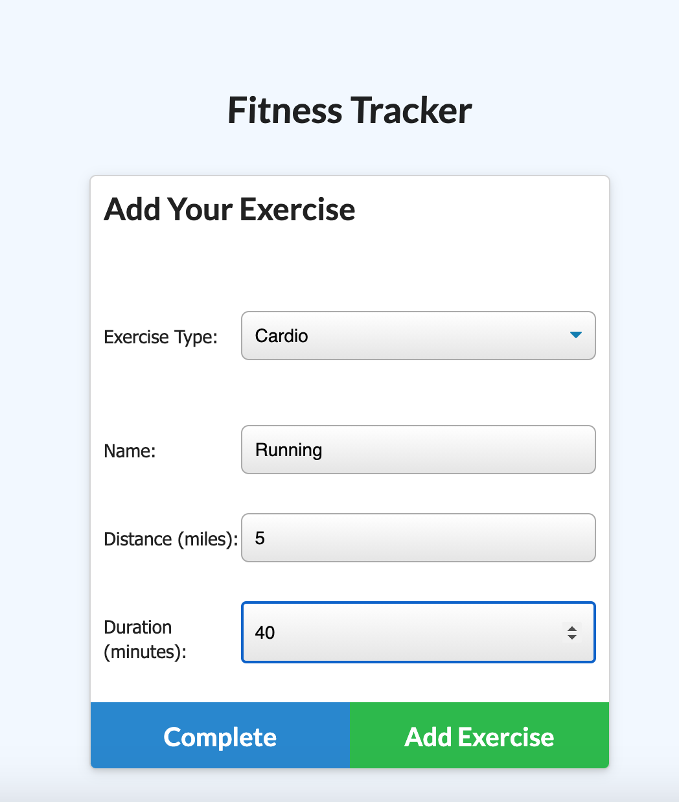
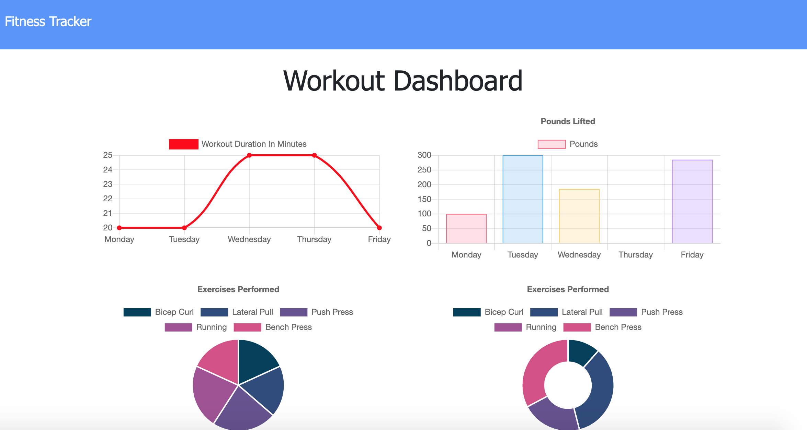

# Workout Tracker

## Description

Workout Tracker allows the user, to view, create and track daily workouts. When the user loads the page, they are given the option to create a new workout or continue with their last workout.

They can log multiple exercises in a workout on a given day. They're also able to track the name, type, weight, sets, reps, and duration of exercise. If the exercise is a cardio exercise, for example, the user is able to track my distance traveled.

## Table of Contents

* [Project Summary](#description)
* [Preview](#preview)
* [Deployed App](#app)
* [Contact Me](#questions)
  
## Preview

Below are some example images of the deployed app!

## App

Here is a link to the deployed app on Heroku: 
[Workout Tracker App](https://working-workouts.herokuapp.com/)

## Questions?

If you have any questions, please don't hesitate to reach out!

Github: [habby-bit](https://github.com/habby-bit)
  
Email: [habbyolu@gmail.com](habbyolu@gmail.com)
